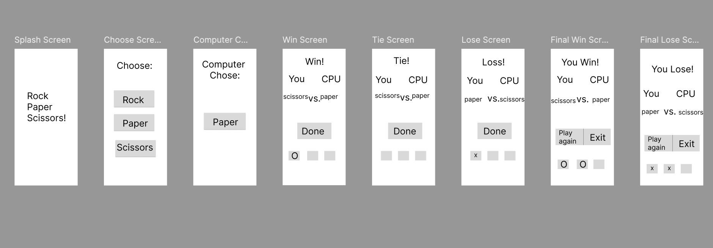

# Final Project  

### Customer Request

*"I want an app that let's me play rock-paper-scissors,I should choose my move, and the app should randomly choose a move and tell me if I won, lost, or tied. The game should be 2 out of 3."

---

## Game Description

**Rock Paper Scissors** is an interactive Flutter app that lets you play the classic Rock Paper Scissors game against the computer. The game follows the best-of-three format where you need to win 2 rounds to claim victory. Simply choose your move (Rock, Paper, or Scissors), and the app will randomly select a move for you to go against. After each round, you'll see the outcome and your updated score. The first player to win 2 rounds wins the match!

## Gameplay Screenshots

**Splash Screen**

**Round Won**

**You Lost**

**You Won**

---

## Behavior-Driven Design

### User Stories

*ADD YOUR STORIES HERE*

 - As a player, I should be able to play rock paper scissors, so that I can see whether I tie, win, or lose in a best of three match.

 - As a player, I want to choose Rock, Paper, or Scissors, so that I can make a move against the app.

 - As a player, I should see the app make a move, so that I have an opponent to go against.

 - As a player, I should see the score, so that I immediately know the round outcome.

 - As a player, I should see who won/lost, so that I know the game is over.

As a player, I should be able to restart the game, so that I can play another match.

### Validation Sketch

### Lo-Fi Prototype

---

## Test-Driven Development

### Happy Paths

**GIVEN** I am on the Choose Screen, **WHEN** I tap "Rock" **AND** the CPU chooses "Scissors", **THEN** I should see "Round Won!" **AND** I should see my move vs CPU move **AND** I should see my score updated with a check.

**GIVEN**  I am on the Choose Screen, **WHEN** I tap "Rock" **AND** the CPU chooses "Scissors", **THEN** I should see "Round Won!" **AND** I should see my move vs CPU move **AND** I should see my score updated with two checks.

**GIVEN** I am on the Choose Screen, **WHEN** I tap "Paper" **AND** the CPU chooses "Scissors", **THEN** I should see "Round Lost!" **AND** I should see my move vs CPU move **AND** I should see my score updated with an X.

**GIVEN** I am on the Choose Screen, **WHEN** I tap "Paper" **AND** the CPU chooses "Scissors", **THEN** I should see "Round Lost!" **AND** I should see my move vs CPU move **AND** I should see my score updated with two X’s.

**GIVEN** I am in a match **AND** I have 2 rounds won **THEN** I should see the Final Win Screen **AND** I should see a score of at least two checks **AND** I should see "Play Again" **AND** "Exit".

**GIVEN** I am in a match **AND** I have 2 rounds lost **THEN** I should see the Final Lose Screen **AND** I should see a score of at least two X’s **AND** I should see "Play Again" **AND** "Exit".

**GIVEN** the match is over **AND** I am on the Final Win or Final Lose Screen, **WHEN** I tap "Play Again", **THEN** I should return to the Choose Screen **AND** the score should be reset.

### Sad Paths

**GIVEN** I am on the Choose Screen, **WHEN** I tap "Continue" **AND** I don't make a selection, **THEN** I should still be in the Choose Screen.

**GIVEN** the match is already over **AND** I am on the Final Win or Final Lose Screen, **WHEN** I tap a move button (Rock, Paper, Scissors), **THEN** nothing should happen **AND** I should remain on the Final Screen.

